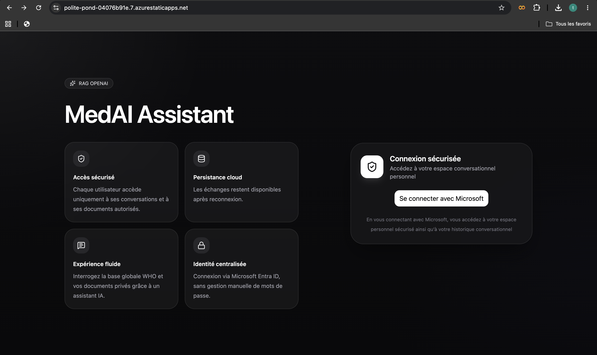

# MedAIssist


MedAIssist est une application full stack orientée santé, construite autour d’une architecture RAG sur Azure.

L’utilisateur se connecte avec Microsoft Entra ID, accède à un espace personnel sécurisé, importe ses documents, puis échange avec un assistant conversationnel capable de s’appuyer sur ses documents indexés pour produire des réponses contextualisées.


---

## Table des matières

- [Démonstration](#démonstration)
- [Fonctionnalités principales](#fonctionnalités-principales)
- [Architecture technique](#architecture-technique)
- [Stack technique](#stack-technique)
- [Ressources Azure à provisionner](#ressources-azure-à-provisionner)
- [Authentification et sécurité](#authentification-et-sécurité)
- [Déploiement](#déploiement)
- [Infrastructure as Code](#infrastructure-as-code)
- [Variables d’environnement](#variables-denvironnement)
- [GitHub Secrets requis](#github-secrets-requis)
- [Lancement en local](#lancement-en-local)
- [CI/CD](#cicd)
- [État actuel du projet](#état-actuel-du-projet)

---
## Démonstration

Une vidéo de démonstration de l'application est disponible ici :

[](https://TouatiSoukaina1.github.io/chat_bot_azure/)

## Fonctionnalités principales

- Authentification utilisateur avec Microsoft Entra ID
- Espace personnel sécurisé
- Historique de conversations persisté
- Import de documents utilisateur
- Découpage automatique des documents en chunks ou selon une taille définie par l’utilisateur
- Génération d’embeddings
- Indexation documentaire dans Azure AI Search
- Chat RAG avec sources documentaires
- Frontend et backend déployés sur Azure
- Déploiement continu avec GitHub Actions

---

## Architecture technique

### Vue d’ensemble

1. Le frontend React/Vite est déployé sur Azure Static Web Apps.
2. L’utilisateur s’authentifie avec Microsoft Entra ID.
3. Le frontend récupère un token et appelle le backend FastAPI.
4. Le backend valide le JWT et identifie l’utilisateur.
5. Les conversations, messages et documents sont stockés dans Cosmos DB.
6. Les documents importés sont normalisés, chunkés puis enrichis avec des embeddings Azure OpenAI.
7. Les chunks sont indexés dans Azure AI Search.
8. Le backend utilise la recherche documentaire et Azure OpenAI pour générer une réponse contextualisée.

### Services Azure utilisés

- **Microsoft Entra ID** : authentification utilisateur
- **Azure Static Web Apps** : hébergement du frontend
- **Azure Container Apps** : hébergement du backend
- **Azure Container Registry (ACR)** : stockage des images Docker
- **Azure Cosmos DB** : persistance des conversations, messages, documents et chunks
- **Azure AI Search** : indexation et recherche vectorielle
- **Azure OpenAI** : embeddings et génération de réponses


---

## Stack technique

### Frontend
- React
- TypeScript
- Vite
- Tailwind CSS
- MSAL (`@azure/msal-browser`, `@azure/msal-react`)

### Backend
- FastAPI
- Python
- Uvicorn

### IA et recherche
- Azure OpenAI
- Azure AI Search

### Données
- Azure Cosmos DB

### Cloud / DevOps
- Azure Container Apps
- Azure Container Registry
- Azure Static Web Apps
- Microsoft Entra ID
- Managed Identity
- GitHub Actions
- Bicep

---

## Ressources Azure à provisionner

Pour exécuter l’application sur Azure, les ressources suivantes sont nécessaires.

### 1. Resource Group
Conteneur logique regroupant l’ensemble des ressources Azure du projet.

### 2. Microsoft Entra ID
Utilisé pour :
- l’authentification utilisateur côté frontend,
- l’enregistrement des applications,
- la configuration des Redirect URIs,
- l’exposition de l’API backend.

### 3. Azure Container Registry (ACR)
Utilisé pour stocker l’image Docker du backend FastAPI.

### 4. Azure Container Apps
Utilisé pour exécuter le backend conteneurisé.

### 5. Azure Static Web Apps
Utilisé pour héberger le frontend React/Vite.

### 6. Azure Cosmos DB for NoSQL
Utilisé pour stocker :
- documents,
- chunks,
- conversations,
- messages,
- work items.

### 7. Azure AI Search
Utilisé pour l’indexation documentaire et la recherche vectorielle.

### 8. Azure OpenAI
Utilisé pour :
- les embeddings,
- la génération de réponses,
- le flux RAG.


---

## Authentification et sécurité

L’application repose sur une authentification Microsoft Entra ID côté frontend avec MSAL.

Le backend vérifie les JWT reçus, contrôle le scope API attendu, puis construit un identifiant utilisateur unique à partir de `tid` et `oid`.

L’accès aux services Azure côté backend repose principalement sur **Managed Identity**, ce qui évite d’exposer des secrets applicatifs dans le code.


---

## Déploiement

### Backend

Le backend est conteneurisé avec Docker puis déployé sur Azure Container Apps.

Le pipeline GitHub Actions :
- build l’image Docker,
- pousse l’image dans Azure Container Registry,
- met à jour Azure Container Apps.

### Frontend

Le frontend est déployé sur Azure Static Web Apps via GitHub Actions.

Les variables `VITE_*` nécessaires au build sont injectées au moment du workflow.

---

## Infrastructure as Code

Une première base **Bicep** a été mise en place pour décrire une partie de l’infrastructure Azure.

### Déjà couvert
- Azure Container Registry
- Azure Container App backend
- Variables d’environnement backend
- Référence à l’environnement Container Apps existant

---

## Variables d’environnement

### Frontend
Variables attendues côté build :

- `VITE_ENTRA_CLIENT_ID`
- `VITE_ENTRA_TENANT_ID`
- `VITE_API_SCOPE`
- `VITE_API_BASE_URL`

### Backend
Variables attendues côté application :

- `COSMOSDB_URI`
- `COSMOS_DATABASE`
- `COSMOSDB_CONTAINER_DOCUMENTS`
- `COSMOSDB_CONTAINER_CHUNKS`
- `COSMOSDB_CONTAINER_WORK_ITEMS`
- `COSMOSDB_CONTAINER_CONVERSATIONS`
- `COSMOSDB_CONTAINER_MESSAGES`
- `AZURE_SEARCH_ENDPOINT`
- `AZURE_SEARCH_INDEX`
- `AZURE_OPENAI_ENDPOINT`
- `AZURE_OPENAI_API_VERSION`
- `AZURE_OPENAI_CHAT_DEPLOYMENT`
- `AZURE_OPENAI_EMBEDDING_DEPLOYMENT`
- `CORS_ALLOW_ORIGINS`
- `APP_ENV`
- `LOG_LEVEL`

---

## GitHub Secrets requis

### Secrets backend / Azure
- `AZURE_CLIENT_ID`
- `AZURE_TENANT_ID`
- `AZURE_SUBSCRIPTION_ID`
- `AZURE_ACR_NAME`
- `AZURE_RESOURCE_GROUP`
- `AZURE_CONTAINER_APP_NAME`

### Secrets frontend
- `VITE_ENTRA_CLIENT_ID`
- `VITE_ENTRA_TENANT_ID`
- `VITE_API_SCOPE`
- `VITE_API_BASE_URL`

### Static Web Apps
- `AZURE_STATIC_WEB_APPS_API_TOKEN_*`

---

## Lancement en local

### Prérequis

- Node.js
- Python
- Azure CLI
- Compte Azure
- Ressources Azure configurées

### Connexion Azure CLI

```bash
az login
az account set --subscription "<YOUR_SUBSCRIPTION>"
```

### Frontend

```bash
cd frontend
npm install
npm run dev
```

### Backend

```bash
cd backend
python -m uvicorn app.main:app --host 0.0.0.0 --port 8000
```

---

## CI/CD

### Backend
Déploiement automatisé via GitHub Actions vers Azure Container Apps avec :
- OIDC GitHub → Azure
- build Docker
- push vers ACR

### Frontend
Déploiement automatisé via GitHub Actions vers Azure Static Web Apps.

---

## État actuel du projet

### Fonctionnel
- Authentification Microsoft
- Chargement des conversations
- Upload de documents
- Traitement et indexation
- Chat RAG avec documents
- Déploiement frontend et backend sur Azure

### En cours d’amélioration
- Renforcement de la sécurité 
- Amélioration continue de l’UX
- Monitoring
- Evaluation 

---

## Auteur

**Soukaina Touati**


